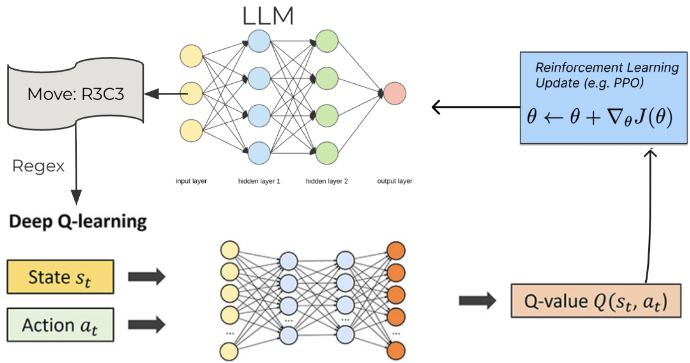

# RLHF finetuning of LLAMA for strategic reasoning

This repository contains the code for training a LLM with RLHF to play strategic reasoning games like Tic-Tac-Toe, Connect-4, Nim etc.

The main idea is to train a DQN and use it as the reward model for the LLM. The whole pipeline is shown in the below figure

## Environment setup

Create a new conda environment using

    conda create -n nlp_work python=3.11

Install the required libraries using 

    pip install -r requirements.txt

## DQN training

DQN training for different games can be run using the following command

    python dqn/learn_dqn.py --game <game_name> --training_episodes <training_episodes> --generate_episodes <generation_episodes>

The supported games are listed below

 * tic_tac_toe
 * pig
 * nim
 * kuhn_poker
 * liar's dice

 Then merge the data for all of the games using the command

    python dqn/merge_data.py --datasets <game_names_separated_by_commas>

## RLHF training with PPO

Now a LLAMA model can be trained using huggingface accelerate on multiple gpus. Adjust the file `scripts/accelerate_run.sh` then submit it to the cluster you are training on. 

By default, the  code uses a LLAMA model but it can be adapted for other LLMs.